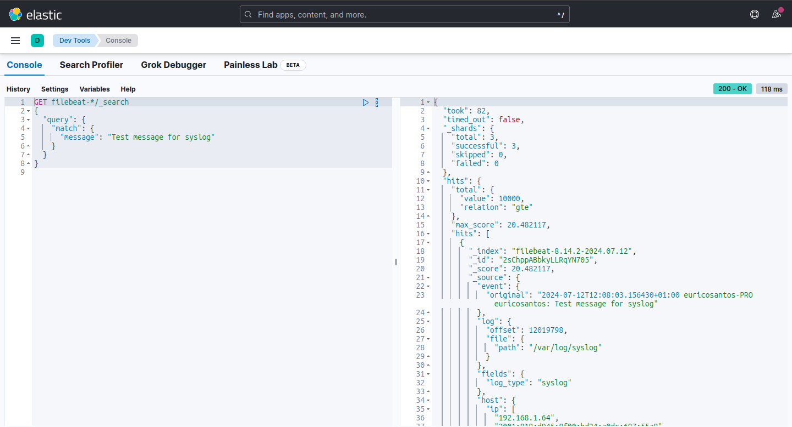

# Add Configuration (Syslog)

## Introduction

This guide explains how to manually configure Filebeat to collect syslog logs. We will set up Filebeat to read syslog logs from local files and send them to Elasticsearch or Logstash.

## Steps

### 1. Configure Filebeat

#### Edit the Filebeat Configuration (`filebeat.yml`)

Open the Filebeat configuration file with your preferred text editor:

```bash
sudo nano /etc/filebeat/filebeat.yml
```

Add the following configuration to collect syslog logs:

```bash
filebeat.inputs:
- type: log
  enabled: true
  paths:
    - /var/log/syslog
    - /var/log/*.log
  fields:
    log_type: syslog
```

#### Configure the Filebeat Output

Ensure that the Filebeat output settings are correctly configured. Here is an example to send logs directly to Logstash:

```yaml
output.logstash:
  hosts: ["localhost:5044"]
```

### 2. Restart Filebeat

After making changes to the filebeat.yml file, restart Filebeat to apply the new configurations:

```bash
sudo systemctl restart filebeat
```

### 3. Check Logs and Status

#### Check Filebeat Status

Verify that Filebeat is running without errors:

```bash
sudo systemctl status filebeat
```

#### Check Filebeat Logs

Check the Filebeat logs to ensure it did not encounter errors on startup:

```bash
sudo journalctl -u filebeat -f
```

#### 4. Verify in Kibana

**Access Discover in Kibana**

```
-In Kibana, go to the "Discover" section.
-Select the appropriate index in Kibana, such as filebeat-*.
-Look for entries that were collected from syslog. You can filter using the log_type field we added earlier:
```

log\_type: syslog

#### 5. Send Test Message

To ensure everything is working correctly, send a test message to the syslog and check if it appears in Kibana:

```bash
logger "Test message for syslog"
```

#### Checking Directly in Elasticsearch

You can query Elasticsearch directly to verify if syslog logs are being indexed.

**Using Kibana Console**

In Kibana, navigate to "Dev Tools" and then "Console".

* Executing a Query
* Execute the following query to search for the test message:

```json

GET filebeat-*/_search
{
  "query": {
    "match": {
      "message": "Test message for syslog"
    }
  }
}
```

This should return documents containing the test message.

<figure><figcaption></figcaption></figure>

#### Checking the Log File

If the message does not appear in Kibana or Elasticsearch, check directly in the syslog log file:

```bash
cat /var/log/syslog | grep "Test message for syslog"
```

#### Complete config of filebeat.yml

Here is a complete example of the filebeat.yml file configured to collect syslog logs:

```yaml
filebeat.inputs:
- type: log
  enabled: true
  paths:
    - /var/log/syslog
    - /var/log/*.log
  fields:
    log_type: syslog

#output.elasticsearch:
  #hosts: ["http://localhost:9200"]
  #username: "elastic"
  #password: "changeme"

output.logstash:
  hosts: ["localhost:5044"]
```

#### Restart Filebeat to apply the settings:

```bash
sudo systemctl restart filebeat
```
