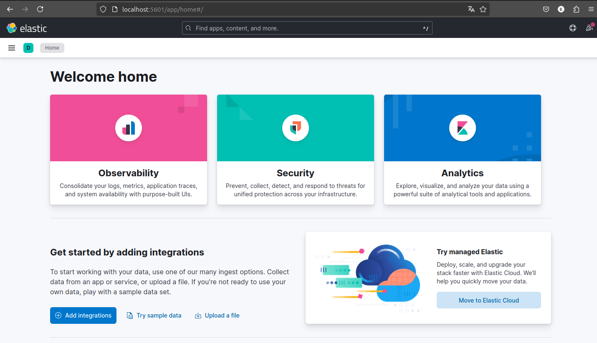

# Kibana

## Step 1: Install Kibana

1. Install Kibana:

```
sudo apt update
sudo apt install kibana
```

### Step 2: Configure Kibana

1. **Edit `kibana.yml`**:
   * Located in `/etc/kibana/kibana.yml`
   *   Important settings:

       ```yaml
       server.port: 5601
       server.host: "0.0.0.0"
       elasticsearch.hosts: ["http://localhost:9200"]
       ```

### Step 3: Start Kibana

1. **Start the service**:
   *   **Linux**:

       ```bash
       sudo systemctl start kibana
       sudo systemctl enable kibana
       ```
2. **Access Kibana**:
   * Open your web browser and go to `http://localhost:5601`.
   * You should see the Kibana interface.

<figure><figcaption></figcaption></figure>
